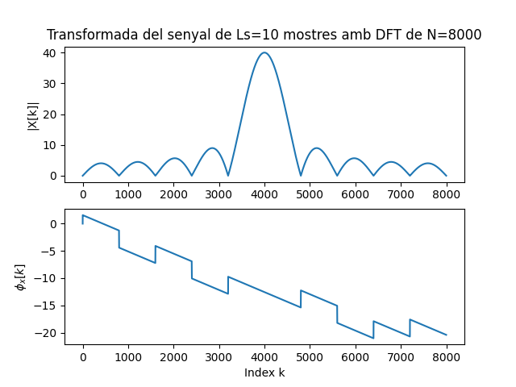
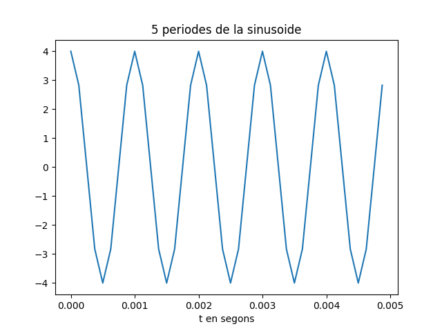
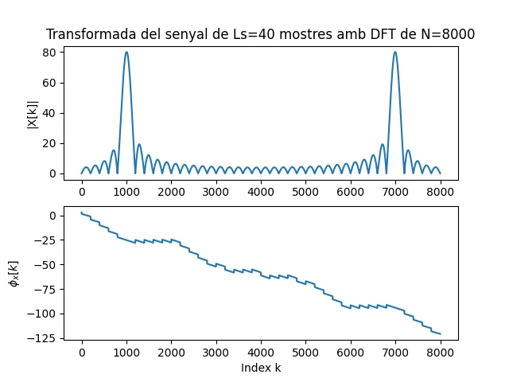
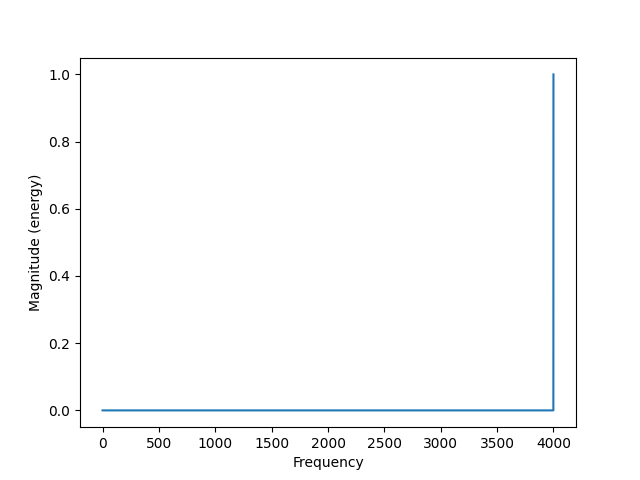
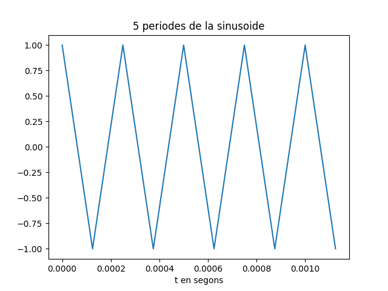
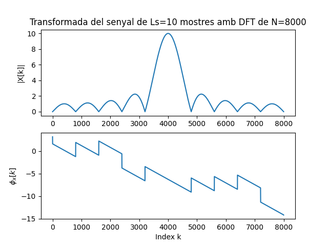
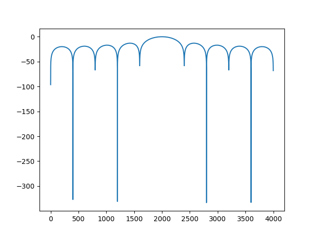
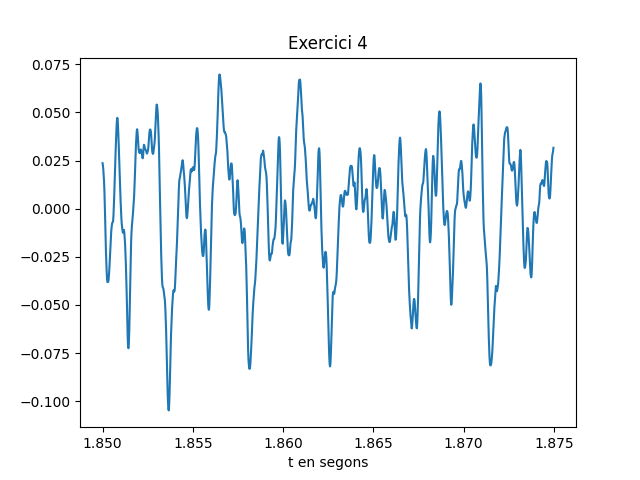
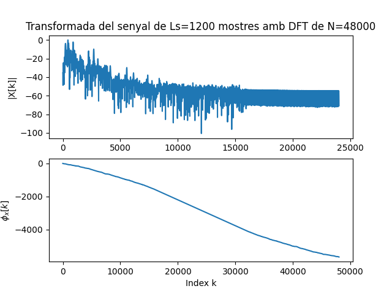
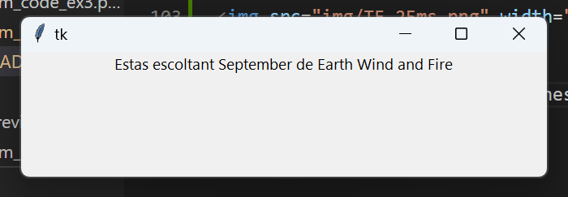

# T1            POL SEDÓ MOTA
## EXERCICI 1:
----

Si considerem la frequencia 4 KHz els 5 seguents persiodes serien aixi:

<br>

Guardem el so en un fitxer anomenat: `so_1.wav`
<br>
El modul i la fase daquests 5 periodes es el seguent:

<br>

---

Ara repetim pero amb una 
* ### Fy=1000Hz

<br>

Guardem al fitxer ``so_2.wav``

<br>

### OBSERVEM:
Quan baixem la frequencia del to a 1k podem veure com els pics dels periodes no estan tan marcats

El modul de la transformada en canvi, ens mostra dos pics principals a la frquencia 1000 i 7000 

## EXERCICI 2:
-----

En aquests segon exercici comencem llegint el fitxer que hem creat anteriorment ``so_1.wav`` el qual conte el to sinusoidal anterior de frequencia 4Khz

Per aconseguir saber aquesta frequencia apartir del fitxer fem el seguent:
``` python
x_r, fm = sf.read('so_1.wav')
magspec = plt.magnitude_spectrum(x_r, fm)
fxx=magspec[1][np.argmax(magspec[0])]
print(f'la frequencia fonamental del to es de "{fxx}"Hz')
```
aqui estem agafant el valor de frequencia a on es troba la delta mes alta de la transformada (fonamental)


<br>

el valor de la variable `` fxx `` hauria de ser 4000

Ara representem 5 periodes del to i la seva transformada:

<br>

<br>
### OBSERVEM:

 observem que els valors de la transformada i els periodes eson molt semblants als de l'exercici 1 ja que llegeix correctament

## EXERCICI 3:
---

En aquest cas l'execisi consisteix en representar el modul en dBs, tornem a repetir el primer apartat de l'exercici anterior
 
 Per tant llegim el fiitxer i i trobem la fxx:
 
<br>
un cop la fxx representem el modul de la TF pero en aquest en dBs

<br>
### OBSERVEM:

 observem que els valors de la transformada tenen unaltre escala i podem veure els lobuls ubicats en les frequencies de resonancia a partir del fonamental.

## EXERCICI 4:
---
En aquests ultim exercici volem reproduir i analitzar un fitxer que contingui audio real, com per exemple una canço.

jo he fet servir el fitxer: ``September_EWF_mono.wav``
``` python
f_AUDIO = 'September_EWF_mono.wav'
x_r, fm = sf.read(f_AUDIO)
print(f'la frequencia de mostreix del fitxer {f_AUDIO} es de "{fm}"Hz')
print(f'te un total de {len(x_r)} mostres')
```
Guardem el fitxer en una variable i llegim amb la funcio utilitzada derrerament, Llavors mostrem per pantalla dades utils comla frequencia de mostratge i el numero de mostres del fitxer.

Despres com demana l'enunciat representem un fragment de 25ms del fitxer; Jo he fet servir el fragment que va desde el 1,85 segons fins el 1,875 segons

``` python
T= 1.85                                 # Inici del segment
T2=1.875                                # final del segment
L = int(fm * T)
L2 = int(fm * T2)  
plt.figure(1)
plt.plot(t,x_r[L:L2])
plt.xlabel('t en segons') 
plt.title('Exercici 4')
plt.show()
```

<br>
Despres representem la seva TF en dBs de la mateixa manera que a l'exercici anterior:

<br>

Despres unicament deixem una finestra oberta amb el seguent text:
``` python
aviso=tkinter.Tk()
W1= ttk.Label(aviso, text='Estas escoltant September de Earth Wind and Fire')
W1.grid(column=0, row=1,padx=20,pady=20)
W1.pack()
aviso.mainloop()
```

<br>
Aixo deixa el programa en execucio el programa i podem sentir la musica. Per tancar el programa hem de tancar aquesta ultima finestra.

### OBSERVEM:

 observem que la transformada mostra pics de frequencies fonamentals sobre el rang audible per tant te sentit i sobretot tenim bastantes frequencies freus elque ens indica que el fitxer conte musica.